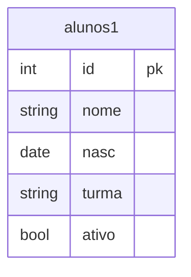

# Gestão de Alunos

Mini sistema CRUD para gerenciamento de alunos, desenvolvido em **PHP + HTML + PostgreSQL**.

## 📋 Sobre o projeto

Sistema simples de cadastro de alunos com as operações de **C**riar, **L**er, **A**tualizar e **D**eletar (CRUD), persistindo os dados em um banco PostgreSQL.

### Funcionalidades

- **Cadastrar aluno** — nome, turma, data de nascimento e status (ativo/inativo)
- **Excluir aluno** — a partir do ID
- **Relatório** — lista todos os alunos cadastrados
- **Consultar aluno** — busca um aluno específico pelo ID
- **Atualizar aluno** — edita os dados de um aluno pelo ID

## 🚀 Tecnologias utilizadas

- PHP (PDO)
- PostgreSQL
- HTML5 / CSS3

## 📁 Estrutura do projeto

```
gestao-alunos-php/
├── index.php
├── app/
│   ├── create.php
│   ├── delete.php
│   ├── select.php
│   ├── select_where.php
│   └── update.php
├── database/
│   └── connect_postgres.php
├── includes/
│   ├── header.php
│   ├── footer.php
│   └── functions.php
└── extra/
    ├── documentacao.md
    └── tabela.md
```

## 🗄️ Banco de dados

Banco: `escola` | Tabela: `alunos1`



## ⚙️ Como executar o projeto

1. Clone o repositório:
   ```bash
   git clone https://github.com/seu-usuario/gestao-alunos-php.git
   ```
2. Crie o banco `escola` no PostgreSQL e a tabela `alunos1` conforme o modelo acima.
3. Configure as credenciais de conexão em `database/connect_postgres.php`:
   ```php
   $host = "seu_host";
   $dbname = "escola";
   $user = "seu_usuario";
   $pass = "sua_senha";
   ```
4. Coloque a pasta do projeto no diretório do seu servidor local (ex: `htdocs` do XAMPP ou `www` do WAMP), ou rode o servidor embutido do PHP:
   ```bash
   php -S localhost:8000
   ```
5. Acesse no navegador: `http://localhost:8000`

## ✅ Requisitos

- PHP 7.4+ com extensão `pdo_pgsql` habilitada
- PostgreSQL

## ⚠️ Observações

- As credenciais do banco em `database/connect_postgres.php` estão fixas no código (hardcoded) — ideal migrar para variáveis de ambiente antes de subir o projeto publicamente.
- O link "Início" no menu (`includes/header.php`) usa caminho absoluto (`/index.php`), enquanto os demais usam caminho relativo (`../app/...`) — pode causar inconsistência dependendo de onde o projeto for hospedado.


## 📄 Licença

Este projeto está sob a licença MIT.
