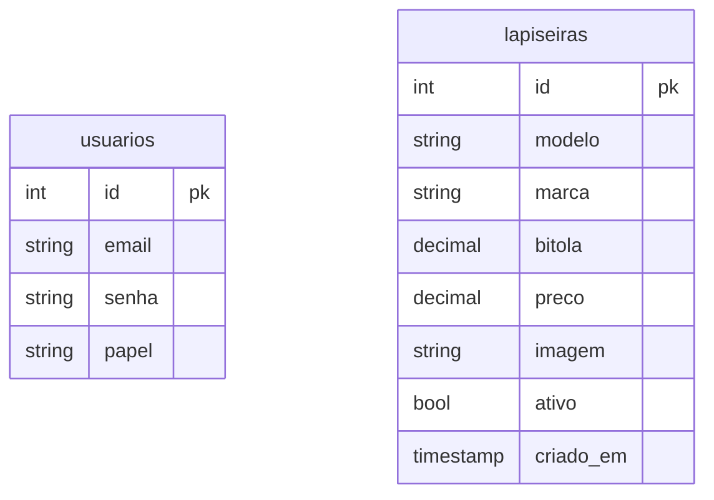

# Lapisari

Loja online de lapiseiras de marcas oficiais, desenvolvida em **PHP + HTML + CSS + JavaScript + PostgreSQL**.

## 📋 Sobre o projeto

CRUD de lapiseiras com vitrine pública, login de usuários, área do administrador e carrinho.

### Funcionalidades

- **Vitrine** — lista as lapiseiras disponíveis, com filtro por bitola e ordenação por novidades ou preço
- **Carrinho** — adicionar e remover modelos (guardado na sessão, sem tabela no banco)
- **Contas** — cadastro público de clientes e login com senha criptografada (`password_hash`)
- **Administração** (só para usuários com papel `admin`):
  - **Cadastrar lapiseira** — modelo, marca, bitola, preço, foto e se aparece na vitrine
  - **Atualizar** — pelo ícone do card, pelo relatório ou pelo ID
  - **Excluir** — pelo ícone do card, pelo relatório ou pelo ID (sempre via POST, com confirmação)
  - **Relatório** — todas as lapiseiras, inclusive as fora da vitrine
  - **Consultar** — busca uma lapiseira pelo ID

## 🚀 Tecnologias utilizadas

- PHP (PDO)
- PostgreSQL
- HTML5 / CSS3 / JavaScript puro (sem frameworks)
- Google Fonts: Cormorant Garamond, Manrope e Mrs Saint Delafield

## 📁 Estrutura do projeto

```
├── index.php                  vitrine (seção conceitual + produtos)
├── app/                       área do administrador
│   ├── create.php             cadastrar lapiseira
│   ├── update.php             atualizar lapiseira
│   ├── delete.php             excluir lapiseira
│   ├── select.php             relatório
│   ├── select_where.php       consultar por ID
│   └── usuarios.php           trocar o papel (cliente/admin) das contas
├── carrinho/
│   ├── index.php              página do carrinho
│   ├── adicionar.php          recebe o POST "Adicionar ao Carrinho"
│   └── remover.php
├── login/
│   ├── login.php
│   ├── logout.php
│   ├── registerUser.php       cadastro de clientes
│   ├── verifica_user.php      exige login
│   └── verifica_admin.php     exige login de admin
├── includes/
│   ├── config.php             BASE_URL e sessão
│   ├── functions.php          consultas ao banco e funções de apoio
│   ├── head.php               <head> compartilhado
│   ├── header.php             header fixo
│   ├── barra_admin.php        barra do administrador
│   ├── form_lapiseira.php     campos do formulário de lapiseira
│   ├── lapiseira.php          a lapiseira em SVG (header e botão do login)
│   ├── assinatura.php         "Lapisari" em SVG de linha única (TRAÇO PROVISÓRIO: troque aqui)
│   ├── metamorfose.php        cartão de login que nasce do header
│   └── footer.php
├── assets/
│   ├── css/                   base, layout, vitrine, forms, login, metamorfose, carrinho, splash
│   ├── js/                    site.js (global), login.js, metamorfose.js, animacoes.js, splash.js e splash-inicio.js
│   └── img/                   imagem padrão de produto
├── uploads/lapiseiras/        fotos enviadas pelo admin
├── database/
│   ├── connect_postgres.php   credenciais do banco
│   └── estrutura.sql          tabelas (rodar manualmente)
└── extra/                     documentação
```

## 🗄️ Banco de dados

Tabelas `usuarios` e `lapiseiras`. O script completo e comentado está em
[`database/estrutura.sql`](database/estrutura.sql).



## ⚙️ Como executar o projeto

1. Rode `database/estrutura.sql` no seu PostgreSQL.
2. Preencha as credenciais em `database/connect_postgres.php`.
3. Coloque o projeto na pasta do servidor (ex.: `htdocs/MINI SISTEMA` no XAMPP) e acesse
   `http://localhost/MINI SISTEMA/`.
   - Se usar outra pasta, ajuste `BASE_URL` em `includes/config.php`.
   - Depois de atualizar CSS/JS, use Ctrl+F5 para o navegador não usar a versão antiga guardada.
   - Com o servidor embutido (`php -S localhost:8000` dentro da pasta do projeto), use `BASE_URL` vazio (`''`).
4. Dê permissão de escrita ao PHP na pasta `uploads/lapiseiras/`.
5. Crie sua conta pelo site e torne-a administradora (só a primeira vez;
   depois, outros admins podem ser definidos pela tela **Usuários** da barra de administração):
   ```sql
   UPDATE usuarios SET papel = 'admin' WHERE email = 'seu@email.com';
   ```

## ✅ Requisitos

- PHP 7.4+ com as extensões `pdo_pgsql`, `fileinfo` e `mbstring`
- PostgreSQL

## 📄 Licença

Este projeto está sob a licença MIT.
