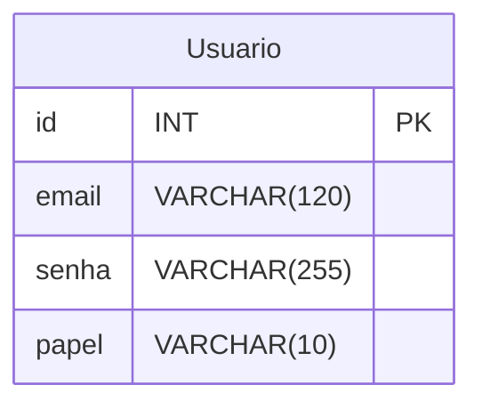

# Levando de requisitos 

## Lapisari: loja de lapiseiras

### CRUD utilizando PHP + HTML + POSTGRESQL

//////////////////////////////////////

### Objetivos : 
1. Cadastrar lapiseira: 
- Receber Modelo, Marca, Bitola, Preço, Foto e se está Ativa (aparece na vitrine)

2. Excluir : 
- Excluir uma lapiseira a partir de um ID

3. Relatório 
- Listar todas as lapiseiras cadastradas no sistema 

4. Consultar lapiseira 
- Onde será feito a consulta de uma lapiseira específica a partir do ID

5. Atualizar uma lapiseira 
- Atualizar lapiseira a partir do ID

6. Vitrine
- Listar as lapiseiras ativas, com filtro por bitola e ordenação por preço/novidades

7. Carrinho
- Adicionar e remover lapiseiras (guardado na sessão)

### Sistema de login 

RF descrição 

1. Tabela usuários  

2. Cadastro de novos usuários (público, todo cadastro nasce como cliente)

3. Criar login (senha verificada com password_verify)

4. Verificar se os usuários são válidos em todas as páginas

5. Só administradores podem cadastrar, atualizar, excluir, consultar e ver o relatório
