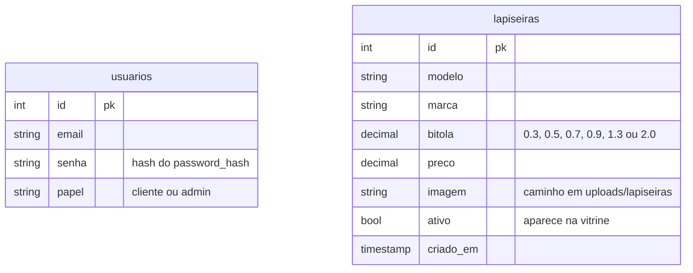

# Tabelas do banco da Lapisari

Script completo: `database/estrutura.sql`

```mermaid
erDiagram
usuarios {
    int id pk
    string email
    string senha "hash do password_hash"
    string papel "cliente ou admin"
}
lapiseiras {
    int id pk
    string modelo
    string marca
    decimal bitola "0.3, 0.5, 0.7, 0.9, 1.3 ou 2.0"
    decimal preco
    string imagem "caminho em uploads/lapiseiras"
    bool ativo "aparece na vitrine"
    timestamp criado_em
}
```
